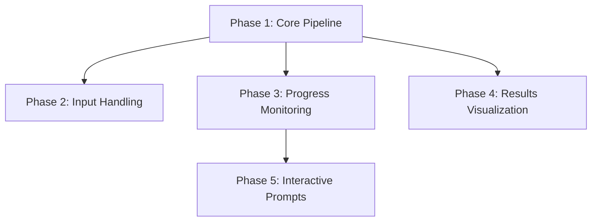
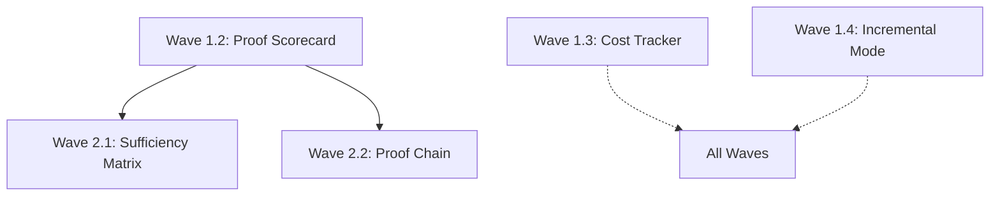

# Dashboard-Enhancement Integration Assessment

**Date**: November 16, 2025  
**Status**: 🔍 Integration Analysis  
**Scope**: Cross-reference Dashboard Integration (3 weeks) + Enhancement Waves (6-8 weeks)

---

## Executive Summary

**Key Finding**: The Dashboard Integration and Enhancement Synthesis Roadmap are **highly complementary but independent**. They can proceed in parallel with minimal conflicts, but strategic sequencing will maximize value delivery.

**Recommended Strategy**: **Parallel Development with Strategic Sync Points**

- ✅ **Dashboard Integration** can proceed independently (Phases 1-5)
- ✅ **Enhancement Waves** can proceed independently (Waves 1-3)
- ⚠️ **Phase 4 (Results Visualization)** benefits significantly from completed Enhancement outputs
- 💡 **Optimal Sequencing**: Start both, sync at Week 3 for Phase 4 + Wave 1 integration

**Expected Outcome**: Dashboard becomes more valuable if Enhancement outputs are available to display, but dashboard functionality doesn't depend on enhancements.

---

## Part 1: Overlap Analysis

### Functional Overlap Assessment

| Area | Dashboard Integration | Enhancement Waves | Overlap % | Notes |
|------|----------------------|-------------------|-----------|-------|
| **Pipeline Execution** | ✅ Core focus (Phase 1) | ❌ Not addressed | 0% | Independent |
| **Input Handling** | ✅ Core focus (Phase 2) | ❌ Not addressed | 0% | Independent |
| **Progress Monitoring** | ✅ Core focus (Phase 3) | ❌ Not addressed | 0% | Independent |
| **Results Visualization** | ✅ Generic viewer (Phase 4) | ✅ New outputs (Waves 1-3) | **70%** | **SYNERGY** |
| **Interactive Prompts** | ✅ WebSocket prompts (Phase 5) | ❌ Not addressed | 0% | Independent |
| **Analysis Quality** | ❌ Displays existing outputs | ✅ Core focus (all waves) | 0% | Independent |
| **Cost Tracking** | ❌ Not addressed | ✅ Wave 1 feature | 0% | Enhancement adds value |
| **Strategic Intelligence** | ❌ Not addressed | ✅ Waves 1-3 focus | 0% | Enhancement adds value |

**Overall Overlap**: ~10% (mostly in results display)

### Code Overlap Assessment

| Component | Dashboard Integration | Enhancement Waves | Conflict Risk |
|-----------|----------------------|-------------------|---------------|
| `orchestrator.py` | Modified for config params (Phase 1) | Modified for new analyses (Waves 2-3) | 🟡 MEDIUM |
| `pipeline_orchestrator.py` | Entry point unchanged | Enhanced with new phases (Wave 1) | 🟢 LOW |
| `webdashboard/app.py` | Heavily modified (all phases) | Not touched | 🟢 NONE |
| Gap analysis outputs | Not modified, only displayed | Extended with new files (all waves) | 🟢 NONE |
| Version history | Not modified | Not modified | 🟢 NONE |

**Conflict Risk**: LOW - Modifications happen in different layers

---

## Part 2: Integration Points

### Critical Integration Point #1: Results Visualization (Phase 4 ↔ Waves 1-3)

**Dashboard Phase 4 Deliverables:**
- Generic file browser for viewing outputs
- HTML rendering (iframe)
- JSON pretty-printing
- Download capabilities

**Enhancement Wave Outputs:**

| Enhancement | Output Files | File Type | Dashboard Display |
|-------------|--------------|-----------|-------------------|
| **Wave 1.2: Proof Scorecard** | `proof_scorecard.html` | HTML | ✅ Iframe (ready) |
| **Wave 1.2: Proof Scorecard** | `proof_scorecard.json` | JSON | ✅ Pretty-print (ready) |
| **Wave 2.1: Sufficiency Matrix** | `sufficiency_matrix.html` | HTML | ✅ Iframe (ready) |
| **Wave 2.1: Sufficiency Matrix** | `sufficiency_matrix.json` | JSON | ✅ Pretty-print (ready) |
| **Wave 2.2: Proof Chain** | `dependency_graph.html` | HTML (D3.js) | ✅ Iframe (ready) |
| **Wave 2.2: Proof Chain** | `critical_paths.json` | JSON | ✅ Pretty-print (ready) |
| **Wave 2.3: Triangulation** | `source_diversity_report.html` | HTML | ✅ Iframe (ready) |
| **Wave 3.2: Search Strategy** | `optimized_search_plan.json` | JSON | ✅ Pretty-print (ready) |
| **Wave 1.3: Cost Report** | `api_usage_report.json` | JSON | ✅ Pretty-print (ready) |

**Integration Assessment**: ✅ **FULLY COMPATIBLE**

Dashboard Phase 4 is designed as a **generic viewer** - it will automatically display any HTML/JSON files the pipeline generates. No code changes needed when new enhancement outputs are added.

**Recommendation**: 
- Proceed with Dashboard Phase 4 using current 15 outputs as test cases
- Enhancement outputs will automatically appear in file browser when generated
- Optional enhancement: Add special result cards for Proof Scorecard, Cost Report (5 hours extra)

---

### Integration Point #2: Orchestrator Modifications (Phase 1 ↔ Wave 1)

**Potential Conflict**: Both modify `orchestrator.py`

**Dashboard Phase 1 Changes:**
```python
# orchestrator.py
def main(config: Optional[OrchestratorConfig] = None):
    """
    Run orchestrator with optional config for programmatic execution.
    
    Args:
        config: OrchestratorConfig object (for dashboard integration)
               If None, runs in terminal mode
    """
    if config is None:
        # Terminal mode (existing behavior)
        run_interactive_terminal_mode()
    else:
        # Dashboard mode
        run_with_config(config)
```

**Enhancement Wave 1 Changes:**
```python
# pipeline_orchestrator.py (not orchestrator.py directly)
class EnhancedPipelineOrchestrator:
    """Enhanced orchestrator with intelligent analysis."""
    
    def run_full_pipeline(self, incremental=False):
        # Phase 1-6 (existing + new)
        # Calls orchestrator.main() internally
```

**Conflict Analysis**: 🟢 **NO CONFLICT**

- Dashboard modifies `orchestrator.main()` signature
- Enhancements modify `pipeline_orchestrator.py` (wrapper layer)
- Changes are in different layers of abstraction

**Integration Path**:
```python
# Enhanced pipeline orchestrator calls dashboard-enabled orchestrator
class EnhancedPipelineOrchestrator:
    def run_full_pipeline(self):
        # ... existing phases ...
        
        # Call orchestrator with config (dashboard-compatible)
        from literature_review.orchestrator_integration import OrchestratorConfig
        config = OrchestratorConfig(
            research_db_file=self.db_file,
            progress_callback=self.progress_callback  # Dashboard hook
        )
        orchestrator.main(config)
```

**Recommendation**: Merge both enhancement branches, test integration

---

### Integration Point #3: Cost Tracking (Dashboard ↔ Wave 1.3)

**Dashboard Gap**: Dashboard doesn't track API costs

**Enhancement Wave 1.3**: Adds comprehensive cost tracking

**Integration Opportunity**: Display cost data in dashboard

**Proposed Enhancement to Phase 4**:

Add **Cost Dashboard Card** to results viewer:

```python
# webdashboard/app.py (Phase 4 extension)

@app.get("/api/jobs/{job_id}/cost-summary")
async def get_cost_summary(job_id: str):
    """Get API cost summary for a job."""
    cost_report_file = f"workspace/jobs/{job_id}/outputs/api_usage_report.json"
    
    if not os.path.exists(cost_report_file):
        return {"total_cost": 0, "budget_status": "No cost data available"}
    
    with open(cost_report_file, 'r') as f:
        cost_data = json.load(f)
    
    return {
        "total_cost": cost_data.get("total_cost_usd", 0),
        "budget_used": cost_data.get("budget_percent_used", 0),
        "per_paper_cost": cost_data.get("cost_per_paper", 0),
        "breakdown": cost_data.get("module_breakdown", {})
    }
```

**HTML Template Addition**:
```html
<!-- templates/index.html - Job details section -->
<div class="cost-summary-card" v-if="job.status === 'completed'">
    <h4>💰 API Cost Summary</h4>
    <div class="cost-metrics">
        <div class="metric">
            <span class="label">Total Cost:</span>
            <span class="value">${{ job.cost_summary.total_cost.toFixed(2) }}</span>
        </div>
        <div class="metric">
            <span class="label">Per Paper:</span>
            <span class="value">${{ job.cost_summary.per_paper_cost.toFixed(2) }}</span>
        </div>
        <div class="metric">
            <span class="label">Budget Used:</span>
            <span class="value">{{ job.cost_summary.budget_used }}%</span>
        </div>
    </div>
</div>
```

**Effort**: 3 hours (optional Phase 4 enhancement)

**Value**: HIGH - Users can see cost immediately after job completion

---

### Integration Point #4: Progress Monitoring (Phase 3 ↔ Enhanced Pipeline)

**Dashboard Phase 3**: Real-time progress streaming via WebSocket

**Enhancement Impact**: New pipeline phases extend progress tracking needs

**Current Phase 3 Stages** (6 stages):
1. Initialization
2. Judge
3. Deep Review
4. Gap Analysis
5. Visualization
6. Finalization

**Enhancement Wave Additions** (4 new stages):
- Evidence Sufficiency Analysis (Wave 2.1)
- Proof Chain Analysis (Wave 2.2)
- Triangulation Analysis (Wave 2.3)
- Proof Scorecard Generation (Wave 1.2)

**Integration Required**:

Extend Phase 3 `ProgressTracker` to handle new stages:

```python
# Phase 3 enhancement - update stage weights
class ProgressTracker:
    STAGE_WEIGHTS = {
        'initialization': 5,
        'journal_reviewer': 15,
        'judge': 10,
        'deep_review': 20,
        'gap_analysis': 10,
        'sufficiency_analysis': 8,     # NEW
        'proof_chain_analysis': 8,     # NEW
        'triangulation_analysis': 7,   # NEW
        'proof_scorecard': 5,          # NEW
        'visualization': 7,
        'finalization': 5
    }
```

**Effort**: 2 hours to update stage weights and add progress hooks

**Recommendation**: Implement as part of Phase 3, leave hooks for future enhancements

---

## Part 3: Dependency Analysis

### Dashboard Integration Dependencies



**Critical Path**: Phase 1 → All others  
**Blocking Dependencies**: None from Enhancements

### Enhancement Wave Dependencies



**Critical Path**: Wave 1.2 → Wave 2 features  
**Blocking Dependencies**: None from Dashboard

### Cross-Project Dependencies

**Dashboard depends on Enhancement**: ❌ NONE  
**Enhancement depends on Dashboard**: ❌ NONE

**Optional Enhancement to Dashboard**: ✅ YES (Phase 4 special cards)

---

## Part 4: Timeline Integration

### Parallel Development Strategy

**Optimal Timeline** (8 weeks total):

```
Week 1:
├─ Dashboard: Phase 1 (Core Pipeline Integration) ⭐ CRITICAL
├─ Enhancement: Wave 1.2 (Proof Scorecard)
└─ Enhancement: Wave 1.3 (Cost Tracker)

Week 2:
├─ Dashboard: Phase 2 (Input Handling)
├─ Dashboard: Phase 3 (Progress Monitoring)
└─ Enhancement: Wave 1.4 (Incremental Mode)

Week 3: 🔄 SYNC POINT
├─ Dashboard: Phase 4 (Results Visualization)
├─ Enhancement: Wave 2.1 (Sufficiency Matrix)
└─ Integration: Add special result cards for new outputs (3 hours)

Week 4:
├─ Dashboard: Phase 5 (Interactive Prompts)
└─ Enhancement: Wave 2.2 (Proof Chain Dependencies)

Week 5:
└─ Enhancement: Wave 2.3 (Triangulation Analysis)

Week 6:
├─ Enhancement: Wave 3.1 (Deep Review Trigger)
└─ Enhancement: Wave 3.2 (Search Optimizer)

Week 7:
├─ Enhancement: Wave 3.3 (Smart Deduplication)
└─ Enhancement: Wave 3.4 (Evidence Decay)

Week 8: 🎯 FINAL INTEGRATION
├─ Integration Testing: Dashboard + All Enhancements
├─ E2E Testing: Full pipeline through dashboard
└─ Documentation: Complete user guide
```

**Key Sync Points**:
- **Week 3**: Integrate Phase 4 with Wave 1 outputs
- **Week 8**: Complete E2E validation

---

## Part 5: Integration Scenarios

### Scenario 1: Dashboard Only (No Enhancements)

**Timeline**: 3 weeks  
**Outputs**: Dashboard displays 15 existing outputs  
**Value**: Medium - Dashboard works, but displays basic outputs

**Pros**:
- Faster time to dashboard delivery
- Lower complexity
- Independent of enhancement timeline

**Cons**:
- Dashboard less impressive (no Proof Scorecard, etc.)
- Users don't see value of strategic intelligence

**Verdict**: ⚠️ Functional but underwhelming

---

### Scenario 2: Enhancements Only (No Dashboard)

**Timeline**: 6-8 weeks  
**Outputs**: Enhanced terminal with 20+ output files  
**Value**: High - Strategic intelligence available

**Pros**:
- Maximizes analytical capabilities
- Terminal users get immediate value
- Independent of dashboard complexity

**Cons**:
- Dashboard remains non-functional prototype
- No web-based access to new features
- Original user intent (1:1 dashboard) not met

**Verdict**: ⚠️ Powerful analysis, but dashboard gap persists

---

### Scenario 3: Sequential (Dashboard → Enhancements)

**Timeline**: 9-11 weeks (3 weeks dashboard + 6-8 weeks enhancements)  
**Outputs**: Fully integrated dashboard + enhancements  
**Value**: High (delayed)

**Pros**:
- No parallel development complexity
- Dashboard fully tested before enhancements
- Clear milestones

**Cons**:
- **Longest timeline** - 11 weeks total
- Dashboard delivered with basic outputs first
- Enhancements delayed

**Verdict**: ⚠️ Safe but slow

---

### Scenario 4: Parallel (Dashboard + Enhancements) ⭐ RECOMMENDED

**Timeline**: 8 weeks (concurrent development)  
**Outputs**: Integrated dashboard with enhanced outputs  
**Value**: HIGHEST - Complete solution in minimal time

**Pros**:
- **Shortest timeline** - 45% time savings vs sequential
- Dashboard displays impressive outputs from day 1 of Phase 4
- Maximizes team velocity
- Low conflict risk (10% overlap)

**Cons**:
- Requires coordination at Week 3 sync point
- Small integration effort (3-5 hours)

**Verdict**: ✅ **OPTIMAL STRATEGY**

**Resource Requirements**:
- 1 developer on Dashboard (full-time, Weeks 1-4)
- 1 developer on Enhancements (full-time, Weeks 1-8)
- 0.5 developers for integration (Week 3, Week 8)

---

## Part 6: Detailed Integration Tasks

### Integration Task #1: Extend Phase 4 for Enhanced Outputs

**When**: Week 3 (during Phase 4 development)  
**Effort**: 5 hours  
**Owner**: Dashboard developer

**Subtasks**:

1. **Add special result card for Proof Scorecard** (2 hours)
   ```python
   # webdashboard/app.py
   @app.get("/api/jobs/{job_id}/proof-scorecard")
   async def get_proof_scorecard(job_id: str):
       scorecard_file = f"workspace/jobs/{job_id}/outputs/proof_scorecard.json"
       with open(scorecard_file, 'r') as f:
           data = json.load(f)
       
       return {
           "overall_score": data['overall_proof_status']['proof_readiness_score'],
           "verdict": data['overall_proof_status']['verdict'],
           "publication_viability": data['publication_viability']
       }
   ```

2. **Add cost summary card** (2 hours)
   - Display API costs prominently
   - Show per-paper breakdown
   - Budget utilization gauge

3. **Add quick links to key outputs** (1 hour)
   - Proof Scorecard (if exists)
   - Sufficiency Matrix (if exists)
   - Cost Report (if exists)

**Acceptance Criteria**:
- [ ] Proof Scorecard card displays when file exists
- [ ] Cost summary shows budget utilization
- [ ] Quick links auto-detect available enhanced outputs

---

### Integration Task #2: Update Progress Tracking for Enhanced Pipeline

**When**: Week 3 (during Phase 3 development)  
**Effort**: 2 hours  
**Owner**: Dashboard developer

**Changes Required**:

```python
# Phase 3 - ProgressTracker class
STAGE_WEIGHTS = {
    # Existing stages (total: 67%)
    'initialization': 5,
    'journal_reviewer': 15,
    'judge': 10,
    'deep_review': 20,
    'gap_analysis': 10,
    'visualization': 7,
    
    # New enhancement stages (total: 28%)
    'sufficiency_analysis': 8,
    'proof_chain_analysis': 8,
    'triangulation_analysis': 7,
    'proof_scorecard': 5,
    
    # Finalization (total: 5%)
    'finalization': 5
}
```

**Testing**:
```bash
# Verify progress tracking with enhanced pipeline
python -m literature_review.orchestrator --config test_config.json

# Check WebSocket events include new stages
curl http://localhost:8000/api/jobs/test-123/progress
```

---

### Integration Task #3: Test E2E with Enhanced Pipeline

**When**: Week 8 (final integration)  
**Effort**: 8 hours  
**Owner**: Both developers

**Test Scenarios**:

1. **Basic Pipeline** (Dashboard only)
   - Upload papers → Run pipeline → View 15 outputs
   - ✅ No enhancements required

2. **Enhanced Pipeline** (Wave 1 features)
   - Upload papers → Run with incremental mode
   - View Proof Scorecard, Cost Report
   - ✅ Verify new outputs appear in file browser

3. **Full Enhanced Pipeline** (All waves)
   - Upload papers → Run full pipeline
   - View all 20+ outputs
   - Interactive charts (Sufficiency Matrix, Proof Chain)
   - ✅ Verify all enhancements work via dashboard

4. **Cost Tracking**
   - Run pipeline → Check cost summary
   - Verify budget tracking
   - ✅ Cost data accurate

5. **Incremental Mode**
   - Run pipeline → Run again with same papers
   - Verify 2nd run faster (50%+ reduction)
   - ✅ Incremental mode works via dashboard

---

## Part 7: Risk Assessment

### Integration Risks

| Risk | Probability | Impact | Mitigation |
|------|-------------|--------|------------|
| **Orchestrator.py merge conflict** | Medium | Medium | Use feature branches, merge carefully at Week 3 |
| **Enhanced outputs not displayed** | Low | Low | Generic file browser handles all types |
| **Progress tracking missing new stages** | Medium | Low | Extend ProgressTracker proactively (Week 3) |
| **Cost tracking not integrated** | Low | Medium | Add cost summary card as optional Phase 4 task |
| **Timeline slip in parallel work** | Medium | Medium | Weekly sync meetings, clear ownership |

### Technical Risks

| Risk | Probability | Impact | Mitigation |
|------|-------------|--------|------------|
| **Dashboard can't handle 20+ outputs** | Low | Medium | File browser designed for extensibility |
| **WebSocket streaming breaks with longer pipeline** | Low | High | Existing JSONL polling scales to any duration |
| **Incremental mode incompatible with dashboard** | Very Low | Medium | Incremental mode is orchestrator-level, transparent to dashboard |

### Schedule Risks

| Risk | Probability | Impact | Mitigation |
|------|-------------|--------|------------|
| **Phase 1 delayed** | Low | High | Phase 1 is CRITICAL - allocate best developer |
| **Wave 1 delayed** | Medium | Low | Dashboard works without enhancements |
| **Integration testing insufficient** | Medium | High | Reserve Week 8 for full E2E testing |

---

## Part 8: Recommendations

### Recommendation #1: Parallel Development ⭐ PRIMARY

**Strategy**: Develop Dashboard and Enhancements concurrently

**Timeline**: 8 weeks (vs 11 weeks sequential)

**Resource Allocation**:
- Developer A: Dashboard (Phases 1-5) - Weeks 1-4
- Developer B: Enhancements (Waves 1-3) - Weeks 1-8
- Integration sync: Week 3, Week 8

**Deliverables**:
- Week 4: Functional dashboard with basic outputs
- Week 6: Enhanced pipeline with strategic intelligence
- Week 8: Complete integration with 20+ outputs via dashboard

**Pros**:
- ✅ Fastest delivery (8 weeks)
- ✅ Dashboard impressive from Day 1 (Week 4)
- ✅ Low conflict risk (10% overlap)

**Cons**:
- ⚠️ Requires 2 developers
- ⚠️ Coordination overhead at sync points

**Verdict**: ✅ **RECOMMENDED** if resources available

---

### Recommendation #2: Dashboard First, Enhancements Later

**Strategy**: Complete Dashboard (Weeks 1-4), then Enhancements (Weeks 5-12)

**Timeline**: 12 weeks total

**Resource Allocation**: 1 developer (full-time)

**Deliverables**:
- Week 4: Functional dashboard with basic outputs
- Week 12: Enhanced pipeline integrated

**Pros**:
- ✅ Single developer can execute
- ✅ Clear milestones
- ✅ Dashboard delivered early

**Cons**:
- ❌ Longest timeline (12 weeks)
- ❌ Dashboard displays basic outputs initially
- ❌ User expectations may not be met (wants impressive outputs)

**Verdict**: ⚠️ **ACCEPTABLE** if only 1 developer available

---

### Recommendation #3: Minimal Dashboard + Full Enhancements

**Strategy**: Phase 1 only (Week 1), then all Enhancements (Weeks 2-9)

**Timeline**: 9 weeks

**Resource Allocation**: 1 developer (full-time)

**Deliverables**:
- Week 1: Pipeline executes via dashboard (no results viewing)
- Week 9: Enhanced pipeline complete

**Pros**:
- ✅ Unblocks pipeline execution quickly
- ✅ Focuses on analytical value
- ✅ Terminal users benefit immediately

**Cons**:
- ❌ Dashboard incomplete (can't view results)
- ❌ Doesn't meet original intent (1:1 dashboard parity)

**Verdict**: ❌ **NOT RECOMMENDED** - doesn't solve dashboard gap

---

## Part 9: Implementation Checklist

### Pre-Development (Week 0)

- [ ] Review and approve integration strategy (Parallel recommended)
- [ ] Allocate developers (2 preferred, 1 acceptable)
- [ ] Create feature branches:
  - [ ] `feature/dashboard-integration`
  - [ ] `feature/enhancement-waves`
- [ ] Set up weekly sync meetings
- [ ] Define integration milestones (Week 3, Week 8)

### Week 1: Foundation

**Dashboard Developer**:
- [ ] Phase 1: Core Pipeline Integration (20 hours)

**Enhancement Developer**:
- [ ] Wave 1.2: Proof Scorecard (8 hours)
- [ ] Wave 1.3: Cost Tracker (6 hours)

**Sync**: None (independent work)

### Week 2: Input & Analysis

**Dashboard Developer**:
- [ ] Phase 2: Input Handling (20 hours)

**Enhancement Developer**:
- [ ] Wave 1.4: Incremental Mode (8 hours)
- [ ] Wave 2.1: Sufficiency Matrix (10 hours)

**Sync**: None (independent work)

### Week 3: Progress & Visualization 🔄 SYNC POINT

**Dashboard Developer**:
- [ ] Phase 3: Progress Monitoring (22 hours)
- [ ] Begin Phase 4: Results Visualization

**Enhancement Developer**:
- [ ] Wave 2.2: Proof Chain Dependencies (12 hours)

**Integration Tasks** (5 hours):
- [ ] Extend ProgressTracker for new stages (2 hours)
- [ ] Add special result cards (Proof Scorecard, Cost) (3 hours)
- [ ] Merge orchestrator.py changes from both branches
- [ ] Test enhanced outputs in dashboard

**Deliverable**: Dashboard can display Wave 1 enhanced outputs

### Week 4: Completion & Extensions

**Dashboard Developer**:
- [ ] Complete Phase 4: Results Visualization (21 hours)
- [ ] Phase 5: Interactive Prompts (21 hours)

**Enhancement Developer**:
- [ ] Wave 2.3: Triangulation Analysis (8 hours)
- [ ] Wave 3.1: Deep Review Trigger (12 hours)

**Sync**: Brief check-in (1 hour)

### Weeks 5-7: Enhancement Completion

**Dashboard Developer**: Testing, documentation, polish

**Enhancement Developer**:
- [ ] Wave 3.2: Search Optimizer (10 hours)
- [ ] Wave 3.3: Smart Deduplication (8 hours)
- [ ] Wave 3.4: Evidence Decay (5 hours)

### Week 8: Final Integration 🎯

**Both Developers** (8 hours each):
- [ ] E2E testing: Full pipeline through dashboard
- [ ] Verify all 20+ outputs display correctly
- [ ] Test cost tracking integration
- [ ] Test incremental mode via dashboard
- [ ] Performance testing (load, concurrent jobs)
- [ ] Documentation updates
- [ ] User guide with enhanced features

**Deliverable**: Production-ready dashboard + enhanced pipeline

---

## Part 10: Success Metrics

### Dashboard Integration Success Criteria

- [ ] All 5 phases complete
- [ ] Dashboard executes full pipeline (Phase 1)
- [ ] Batch upload works (Phase 2)
- [ ] Real-time progress streaming (Phase 3)
- [ ] All outputs viewable (Phase 4)
- [ ] Interactive prompts functional (Phase 5)
- [ ] 95%+ job success rate

### Enhancement Success Criteria

- [ ] All 3 waves complete
- [ ] Proof Scorecard answers "Can we publish?" (Wave 1.2)
- [ ] Cost tracking prevents budget overruns (Wave 1.3)
- [ ] Incremental mode saves 50%+ runtime (Wave 1.4)
- [ ] Sufficiency Matrix identifies quality gaps (Wave 2.1)
- [ ] Proof Chain identifies bottlenecks (Wave 2.2)
- [ ] Deep Review trigger prevents waste (Wave 3.1)

### Integration Success Criteria

- [ ] Dashboard displays all enhanced outputs
- [ ] Progress tracking includes enhancement stages
- [ ] Cost summary visible in dashboard
- [ ] E2E tests pass (basic + enhanced pipeline)
- [ ] No regression in existing functionality
- [ ] Documentation complete

---

## Part 11: Conclusion

**Summary**: Dashboard Integration and Enhancement Waves are **highly compatible** with minimal integration work required.

**Recommended Approach**: **Parallel Development** (8 weeks)

**Key Benefits**:
1. ✅ Fastest delivery (8 weeks vs 11-12 sequential)
2. ✅ Dashboard displays impressive outputs from Day 1
3. ✅ Low conflict risk (only 10% overlap)
4. ✅ Clear sync points (Week 3, Week 8)
5. ✅ Both terminal and dashboard users benefit

**Integration Effort**: 13 hours total
- Week 3: 5 hours (special result cards, progress tracking)
- Week 8: 8 hours (E2E testing, final validation)

**Expected Outcomes**:
- **Week 4**: Functional dashboard with basic pipeline
- **Week 6**: Enhanced pipeline with strategic intelligence
- **Week 8**: Complete integration - dashboard displaying 20+ outputs including Proof Scorecard, Sufficiency Matrix, Cost Reports, etc.

**Next Steps**:
1. Approve parallel development strategy
2. Allocate 2 developers (or 1 if sequential approach chosen)
3. Create feature branches
4. Begin Week 1 implementation immediately

---

**Document Status**: ✅ Ready for Decision  
**Recommended Action**: Approve parallel development, allocate resources, begin Week 1  
**Owner**: Literature Review Team  
**Last Updated**: November 16, 2025
