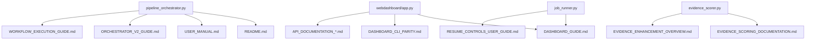

# 📊 Documentation Dependency Matrix

> **Purpose:** Master index of all documentation with dependencies, status, and ownership assignments for coordinated agent-driven updates.

---

> 🔄 **Related:** See [N8N_DOCUMENTATION_CHAIN_BLUEPRINT.md](N8N_DOCUMENTATION_CHAIN_BLUEPRINT.md) for the automated update chain system that uses this matrix.

---

## 🗺️ Matrix Overview

This matrix enables:
1. **Dependency tracking** - Know which docs must be updated when code changes
2. **Cascade ordering** - Update documents in the correct sequence
3. **Agent ownership** - Assign responsibility for documentation areas
4. **Status monitoring** - Track currency and completeness

---

## 📈 Update Priority Levels

| Level | Description | Cascade Impact |
|-------|-------------|----------------|
| **L1-Core** | Root documentation, highest traffic | Updates cascade to all L2-L3 |
| **L2-Feature** | Feature-specific docs | Updates may cascade to L3 |
| **L3-Reference** | Reference/historical docs | Terminal - no cascade |

---

## 🔗 Dependency Matrix

### L1 - Core Documentation (Update First)

| Document | Last Updated | Status | Dependencies | Script References | Owner |
|----------|--------------|--------|--------------|-------------------|-------|
| `README.md` | 2025-12-06 | ✅ Current | DASHBOARD_GUIDE, CONSOLIDATED_ROADMAP, INCREMENTAL_REVIEW | pipeline_orchestrator.py | `@core` |
| `docs/README.md` | 2025-12-06 | ✅ Current | All docs/, architecture/, guides/ | — | `@docs` |
| `docs/USER_MANUAL.md` | 2025-11-16 | ⚠️ Review | DASHBOARD_GUIDE, OUTPUT_FILE_REFERENCE | pipeline_orchestrator.py, app.py | `@core` |
| `docs/DASHBOARD_GUIDE.md` | 2025-12-06 | ✅ Current | DASHBOARD_CLI_PARITY | webdashboard/app.py, job_runner.py | `@dashboard` |
| `docs/CONSOLIDATED_ROADMAP.md` | 2025-11-14 | ⚠️ Review | EVIDENCE_ENHANCEMENT_OVERVIEW, task-cards/ | pipeline_orchestrator.py | `@roadmap` |

### L2 - Feature Documentation

#### Evidence & Scoring
| Document | Last Updated | Status | Dependencies | Script References | Owner |
|----------|--------------|--------|--------------|-------------------|-------|
| `docs/EVIDENCE_ENHANCEMENT_OVERVIEW.md` | 2025-11-14 | 📋 Complete | EVIDENCE_TRIANGULATION_GUIDE, TEMPORAL_COHERENCE_GUIDE | evidence_scorer.py | `@evidence` |
| `docs/EVIDENCE_TRIANGULATION_GUIDE.md` | 2025-11-14 | 📋 Complete | — | evidence_triangulation.py | `@evidence` |
| `docs/TEMPORAL_COHERENCE_GUIDE.md` | 2025-11-14 | 📋 Complete | — | temporal_coherence.py | `@evidence` |
| `docs/EVIDENCE_EXTRACTION_ENHANCEMENTS.md` | 2025-11-14 | 📋 Complete | — | evidence_extraction.py | `@evidence` |
| `docs/EVIDENCE_SCORING_DOCUMENTATION.md` | 2025-12-06 | ✅ Current | — | evidence_scorer.py | `@evidence` |

#### Incremental Review
| Document | Last Updated | Status | Dependencies | Script References | Owner |
|----------|--------------|--------|--------------|-------------------|-------|
| `docs/INCREMENTAL_REVIEW_USER_GUIDE.md` | 2025-12-06 | ✅ Current | INCREMENTAL_REVIEW_MIGRATION_GUIDE | pipeline_orchestrator.py | `@incremental` |
| `docs/INCREMENTAL_REVIEW_MIGRATION_GUIDE.md` | 2025-12-06 | ✅ Current | — | pipeline_orchestrator.py | `@incremental` |
| `docs/guides/RESUME_CONTROLS_USER_GUIDE.md` | 2025-11-22 | ⚠️ Review | DASHBOARD_GUIDE | job_runner.py, app.py | `@incremental` |

#### Dashboard & CLI
| Document | Last Updated | Status | Dependencies | Script References | Owner |
|----------|--------------|--------|--------------|-------------------|-------|
| `docs/DASHBOARD_CLI_PARITY.md` | 2025-12-06 | ✅ Current | — | app.py, pipeline_orchestrator.py | `@dashboard` |
| `docs/DASHBOARD_ORCHESTRATOR_GAP_ANALYSIS.md` | 2025-11-16 | 🗄️ Archivable | — | — | `@archive` |
| `docs/DASHBOARD_ENHANCEMENT_INTEGRATION_ASSESSMENT.md` | 2025-11-16 | 🗄️ Archivable | — | — | `@archive` |
| `docs/DASHBOARD_SMOKE_TEST.md` | 2025-11-16 | 🗄️ Archivable | — | — | `@archive` |

#### Output & API
| Document | Last Updated | Status | Dependencies | Script References | Owner |
|----------|--------------|--------|--------------|-------------------|-------|
| `docs/OUTPUT_FILE_REFERENCE.md` | 2025-12-06 | ✅ Current | OUTPUT_MANAGEMENT_STRATEGY | — | `@output` |
| `docs/OUTPUT_MANAGEMENT_STRATEGY.md` | 2025-12-06 | ✅ Current | — | — | `@output` |
| `docs/API_DOCUMENTATION_README.md` | 2025-12-06 | ✅ Current | API_DOCUMENTATION_SUMMARY | app.py | `@api` |
| `docs/API_DOCUMENTATION_SUMMARY.md` | 2025-12-06 | ✅ Current | — | app.py | `@api` |
| `docs/API_COST_TRACKER.md` | 2025-11-16 | ⚠️ Review | — | cost_tracker.py | `@api` |

#### Testing
| Document | Last Updated | Status | Dependencies | Script References | Owner |
|----------|--------------|--------|--------------|-------------------|-------|
| `docs/TESTING_GUIDE.md` | 2025-12-06 | ✅ Current | tests/README.md | pytest, tests/ | `@testing` |
| `docs/SMOKE_TESTING_BEST_PRACTICES.md` | 2025-11-16 | 📋 Complete | — | — | `@testing` |
| `docs/MANUAL_TESTING_GUIDE.md` | 2025-11-16 | ⚠️ Review | — | — | `@testing` |
| `docs/TEST_MODIFICATIONS.md` | 2025-11-14 | 🗄️ Archivable | — | — | `@archive` |

### L2 - Architecture & Development

| Document | Last Updated | Status | Dependencies | Script References | Owner |
|----------|--------------|--------|--------------|-------------------|-------|
| `docs/architecture/ARCHITECTURE_ANALYSIS.md` | 2025-11-14 | 📋 Complete | — | All core modules | `@architecture` |
| `docs/architecture/ARCHITECTURE_REFACTOR.md` | 2025-11-14 | 📋 Complete | — | — | `@architecture` |
| `docs/RESEARCH_AGNOSTIC_ARCHITECTURE.md` | 2025-11-14 | 📋 Complete | — | pillar_definitions.json | `@architecture` |
| `docs/ORCHESTRATOR_V2_GUIDE.md` | 2025-11-14 | ⚠️ Review | — | pipeline_orchestrator.py | `@architecture` |
| `docs/DEPLOYMENT_GUIDE.md` | 2025-12-06 | ✅ Current | — | docker-compose.yml | `@deployment` |
| `docs/SCALING_GUIDE.md` | 2025-12-06 | ✅ Current | — | — | `@deployment` |

### L2 - Guides

| Document | Last Updated | Status | Dependencies | Script References | Owner |
|----------|--------------|--------|--------------|-------------------|-------|
| `docs/guides/WORKFLOW_EXECUTION_GUIDE.md` | 2025-11-16 | ⚠️ Review | USER_MANUAL | pipeline_orchestrator.py | `@guides` |
| `docs/guides/GENEALOGY_USER_GUIDE.md` | 2025-12-06 | ✅ Current | — | job_runner.py | `@guides` |
| `docs/guides/PARALLEL_DEVELOPMENT_STRATEGY.md` | 2025-11-14 | 📋 Complete | — | — | `@guides` |
| `docs/guides/GOOGLE_AI_SDK_BEST_PRACTICES.md` | 2025-11-14 | 📋 Complete | — | — | `@guides` |
| `docs/guides/FRESH_ANALYSIS_TRIGGER_README.md` | 2025-12-06 | ✅ Current | — | app.py | `@guides` |

### L3 - Status Reports & Assessments

| Document | Last Updated | Status | Dependencies | Script References | Owner |
|----------|--------------|--------|--------------|-------------------|-------|
| `docs/status-reports/EXECUTION_INFRASTRUCTURE_STATUS.md` | 2025-11-14 | 🗄️ Archivable | — | — | `@archive` |
| `docs/status-reports/TESTING_STATUS_SUMMARY.md` | 2025-11-14 | 🗄️ Archivable | — | — | `@archive` |
| `docs/status-reports/TASK_CARD_*.md` | 2025-11-14 | 🗄️ Archivable | — | — | `@archive` |
| `docs/assessments/*.md` | 2025-11-14-16 | 🗄️ Archivable | — | — | `@archive` |
| `docs/SUFFICIENCY_MATRIX.md` | 2025-11-16 | 🗄️ Archivable | — | — | `@archive` |
| `docs/WEEK3_INTEGRATION_STATUS.md` | 2025-12-06 | 🗄️ Archivable | — | — | `@archive` |
| `docs/CHECKPOINT_ARCHITECTURE_GAPS.md` | 2025-11-16 | 🗄️ Archivable | — | — | `@archive` |
| `docs/PARALLEL_DEVELOPMENT_*.md` | 2025-11-16 | 🗄️ Archivable | — | — | `@archive` |
| `docs/ENHANCEMENT_SYNTHESIS_ROADMAP.md` | 2025-11-16 | 🗄️ Archivable | — | — | `@archive` |

---

## 📂 Task Cards

### Active Task Cards (dashboard-cli-parity/)
| Document | Last Updated | Status | Dependencies | Owner |
|----------|--------------|--------|--------------|-------|
| `PARITY-MASTER.md` | 2025-11-24 | ⚠️ Active | All PARITY-*.md | `@parity` |
| `PARITY-W3-2-Direct-Directory-Input.md` | 2025-11-24 | ✅ Complete | — | `@parity` |
| `PARITY-W3-3-Theme-Persistence.md` | 2025-11-24 | 📋 Pending | — | `@parity` |
| `PARITY-W4-*.md` | 2025-11-24 | 📋 Pending | — | `@parity` |
| `PARITY-W5-*.md` | 2025-11-24 | 📋 Pending | — | `@parity` |
| `PARITY-W6-*.md` | 2025-11-24 | 📋 Pending | — | `@parity` |

### Completed Task Cards (Other Folders)
| Folder | Count | Status | Owner |
|--------|-------|--------|-------|
| `task-cards/integration/` | 4 | 🗄️ Archivable | `@archive` |
| `task-cards/evidence-enhancement/` | 9 | 📋 Complete | `@archive` |
| `task-cards/e2e/` | 2 | 📋 Complete | `@archive` |
| `task-cards/automation/` | 4 | 📋 Complete | `@archive` |
| `task-cards/agent/` | 1 | 📋 Complete | `@archive` |

---

## 📦 Archive Documentation

### docs/archive/ Structure
| Folder | Count | Purpose | Status |
|--------|-------|---------|--------|
| `implementation-summaries/` | 36 | Completed feature implementations | 🗄️ Archived |
| `smoke-tests/` | 7 | Historical smoke test reports | 🗄️ Archived |
| `pr-reviews/` | 5 | PR assessment reports | 🗄️ Archived |
| `verification-reports/` | 6 | Milestone verification | 🗄️ Archived |

### reviews/ Structure
| Folder | Count | Purpose | Status |
|--------|-------|---------|--------|
| `reviews/pull-requests/` | 18 | PR assessments | 🗄️ Archived |
| `reviews/third-party/` | 4 | Third-party analyses | 🗄️ Archived |

---

## 🔄 Cascade Update Logic

### When Core Code Changes

### Update Order

When making changes, update documents in this order:

1. **Code Implementation** → Verify functionality works
2. **L1 Core Docs** → README, USER_MANUAL (if affected)
3. **L2 Feature Docs** → Specific feature guides
4. **L3 Reference** → Status reports, assessments (usually no update needed)
5. **Archive** → Move superseded docs to archive/

---

## 👥 Agent Ownership Domains

| Domain | Tag | Scope | Key Docs |
|--------|-----|-------|----------|
| Core | `@core` | Main entry points, overview | README, USER_MANUAL |
| Dashboard | `@dashboard` | Web UI, API | DASHBOARD_GUIDE, DASHBOARD_CLI_PARITY |
| Evidence | `@evidence` | Scoring, triangulation | EVIDENCE_* docs |
| Incremental | `@incremental` | Resume, incremental review | INCREMENTAL_REVIEW_* docs |
| Output | `@output` | File outputs, formats | OUTPUT_* docs |
| API | `@api` | REST API, SDK | API_DOCUMENTATION_* |
| Testing | `@testing` | Test guides, procedures | TESTING_*, tests/README |
| Architecture | `@architecture` | System design | architecture/, ORCHESTRATOR_V2 |
| Deployment | `@deployment` | Docker, scaling | DEPLOYMENT_GUIDE, SCALING_GUIDE |
| Guides | `@guides` | User guides, how-tos | guides/ folder |
| Parity | `@parity` | CLI-Dashboard parity tasks | dashboard-cli-parity/ |
| Roadmap | `@roadmap` | Project planning | CONSOLIDATED_ROADMAP |
| Docs | `@docs` | Documentation index | docs/README |
| Archive | `@archive` | Historical docs | archive/, reviews/ |

---

## 📊 Status Legend

| Status | Meaning | Action Required |
|--------|---------|-----------------|
| ✅ Current | Up-to-date with latest code | None |
| ⚠️ Review | May need updates | Review against current code |
| 📋 Complete | Feature complete, stable | None unless code changes |
| 📋 Pending | Planned but not started | Implementation needed |
| 🗄️ Archivable | Historical, can be archived | Move to archive/ |
| ❌ Superseded | Replaced by newer doc | Archive or delete |

---

## 📉 Statistics

| Category | Count | Current | Needs Review | Archivable |
|----------|-------|---------|--------------|------------|
| Core Docs | 5 | 4 | 1 | 0 |
| Feature Docs | 28 | 15 | 5 | 8 |
| Guides | 5 | 3 | 1 | 1 |
| Status/Assessments | 15+ | 0 | 0 | 15+ |
| Task Cards | 25+ | 1 | 0 | 20+ |
| Archive | 54 | — | — | — |
| **Total** | **252** | **~23** | **~7** | **~43** |

---

## 🔧 Maintenance Procedures

### Adding New Documentation
1. Determine category (Core, Feature, Guide, etc.)
2. Add to appropriate folder
3. Update this matrix with dependencies
4. Assign owner domain
5. Set initial status

### Updating Existing Documentation
1. Check this matrix for dependencies
2. Update in cascade order (L1 → L2 → L3)
3. Update "Last Updated" date in matrix
4. Review dependent docs for needed updates

### Archiving Documentation
1. Confirm doc is superseded or historical
2. Move to appropriate `archive/` subfolder
3. Update this matrix (remove from active, add to archive count)
4. Update `archive/README.md` if needed

---

*Last Updated: 2025-12-10*
*Matrix Version: 1.2*
