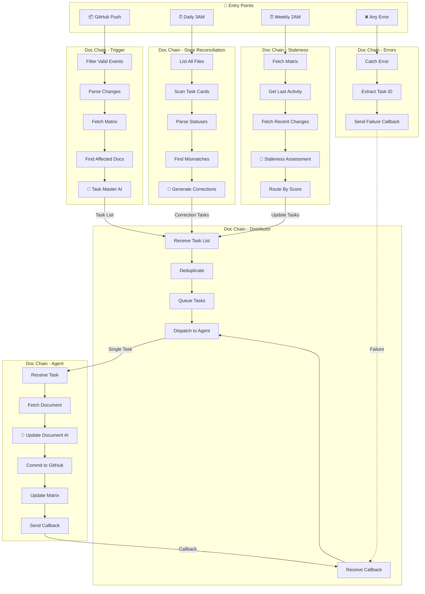

# Doc Chain System Architecture Diagram

**🎯 Generated Title: Doc Chain AI Task Pipeline**

## Mermaid Diagram

## Interactive Editor

[🎨 Open in Mermaid Live Editor](https://mermaid.ai/live/edit?utm_source=mermaid_mcp_server&utm_medium=remote_server&utm_campaign=claude#pako:eNqNVcFu00AQ_ZWV70VqnPTAAWkbu0klKhXbwIFw2NjbZFXHjnbXpRHlDxAckLghLogrfBNfwCcwu7N2s3YJ5OCVZ97OvDcznrwN8rrgwePgqqzf5GsmNclOFxWBn2qWK8m2a5JJsVpxqV4tgt9fP_wgcaXljlzWotJqEbxGtPnN5hby6TuZCT1vluSyUWsPkU7ncXQMqF8ff5KIiXJHQnoxhIwc5CXn14AZ9TBxkhjAl_eEVjsSS1nLzs-rYlE9rADuRHVOpmsmKnLUWr3ImSF3JkrNJXnBSlGQ-Ib3dWaG3iWTiptY1Yr33KGJwXW-JhdMS3Hre8c2Q1UQenXFc80LAqR6ESa2kN8-k4ypa4iiDB96flBkqpnmCc_rqqfTOoj15KIUTIu68kueGNVPhdKEliUB-T1FaWIUpzmrkNCUyaKPCLuamHyNGoTodF8ItWFQnQGiUz3jFZeG9LSWEmoEhNW_tJdwR6mhdLT7mbDLf-tQavs745o8ZaYkkP9G6F0Pc99kqCyMyIOjkNpuW00dFUIVFEdt4E4Pa_QndQO6T3ckzWvJD4qOoGFSLBtd9yd7z-OlsJ-eoStuOHbSNN2HGO0RL5ptKXJoge80op81vMHbvtbISIXMW9NbomtCV32J0WQv_5SV5ZLl1wc12hg9dcO4tK_L9466VkGYZlB4GrY9er4tzNS1qP0vzgKNwmm92Qht9OGS8xFGoIvywGTRE_MZgc7_E28XW3-k0eivQyN_asvu70LrNOrjWy1ZrrHn55EPCFtSZ7CQG3m4M7M5OTp6AnsSX7NjfB3hEeIxxmOCGHzi6rcO2DfOlrSGkTtDd47dOQzhkC2B1DFIs9bhQjgSqc8imxjr3SLYm_47-C5aPq37fvG0k76H6oK4Tg8Q-HRqHeMIeUVj5xy7GKmoVmU7tXcwyuineJniZYqXKWqiEzxOHPSkJd31Dag42dHES4tP-P-01tglizFZjMni0Fkh6SMb2A0Gxg3e_QG7OmJ7)

## Architecture Overview

### Entry Points (4 Triggers)
| Trigger | Schedule | Workflow |
|---------|----------|----------|
| GitHub Push | On push event | Trigger |
| Daily 3AM | Cron schedule | State Reconciliation |
| Weekly 2AM | Cron schedule | Staleness |
| Any Error | Error event | Errors |

### Workflow Flow

1. **Trigger/StateRecon/Staleness** → Generate task lists
2. **Distributor** → Receives tasks, deduplicates, queues, dispatches one at a time
3. **Agent** → Processes single task, commits to GitHub, sends callback
4. **Distributor** → Receives callback, dispatches next task
5. **Errors** → Catches failures, sends failure callback to unblock queue

### Key Components

- **3 AI-Powered Nodes**: Task Master, Generate Corrections, Staleness Assessment, Update Document
- **1 Central Queue**: Distributor manages all task dispatch
- **1 Error Handler**: Global error catching and recovery
- **1 Shared State**: `documentation_matrix.json` tracks all documents
