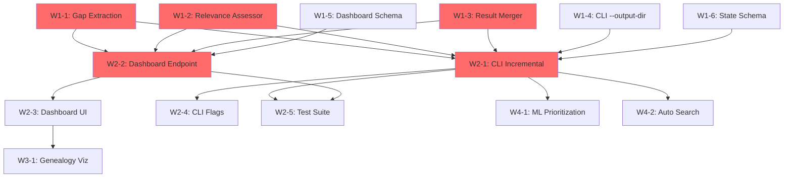

# Incremental Review & Dashboard Parity - Wave Implementation Plan

**Date:** 2025-01-19  
**Purpose:** Waved task card submission for incremental review features and dashboard/CLI parity improvements  
**Strategy:** Maximize parallel execution and deployment velocity

---

## Executive Summary

This plan organizes **16 task cards** across **4 waves** to implement:
1. **Incremental Review Logic** (CLI & Dashboard)
2. **Dashboard/CLI Parity Improvements** (from DASHBOARD_CLI_PARITY.md roadmap)

**Total Effort:** ~85-110 hours (10-14 developer-days)  
**Timeline:** 3-4 weeks with 2-3 parallel developers  
**Dependencies:** Minimal cross-wave blocking

---

## Wave Architecture

```
Wave 1: Foundation (Independent Tasks)
├── CLI Core Logic
├── Dashboard Infrastructure
└── Shared Utilities
    ↓
Wave 2: Integration (Depends on Wave 1)
├── CLI Incremental Mode
├── Dashboard Continuation Mode
└── Cross-System Features
    ↓
Wave 3: User Experience (Depends on Wave 2)
├── UI Enhancements
├── Monitoring & Observability
└── Bulk Operations
    ↓
Wave 4: Advanced Features (Optional)
├── ML-Based Prioritization
├── Automated Search
└── Analytics & Insights
```

---

## Wave 1: Foundation (Week 1) - 6 Tasks, ~28-36 hours

**Goal:** Build core primitives needed for incremental review  
**Parallelization:** All 6 tasks can run in parallel  
**Risk:** Low (isolated changes, no dependencies)

### INCR-W1-1: Gap Extraction & Analysis Engine
**Priority:** 🔴 Critical  
**Effort:** 6-8 hours  
**Assignable:** Backend Developer  
**Dependencies:** None

**Scope:**
- Create `literature_review/analysis/gap_analyzer.py`
- Implement `extract_gaps()` function
- Add `GapAnalyzer` class with methods:
  - `extract_gaps(report: Dict, threshold: float) -> List[Gap]`
  - `classify_gap_severity(gap: Gap) -> str`
  - `generate_gap_summary(gaps: List[Gap]) -> Dict`

**Deliverables:**
- [ ] `gap_analyzer.py` with full implementation
- [ ] Unit tests (90% coverage)
- [ ] API documentation

**Success Criteria:**
- Can extract gaps from `gap_analysis_report.json`
- Correctly filters by completeness threshold
- Returns structured `Gap` objects

---

### INCR-W1-2: Paper Relevance Assessor
**Priority:** 🔴 Critical  
**Effort:** 6-8 hours  
**Assignable:** ML/NLP Developer  
**Dependencies:** None

**Scope:**
- Create `literature_review/analysis/relevance_assessor.py`
- Implement keyword-based relevance scoring
- Optional: Semantic similarity (sentence-transformers)

**Deliverables:**
- [ ] `relevance_assessor.py` with `assess_gap_closing_potential()`
- [ ] Configurable scoring algorithms (keyword vs semantic)
- [ ] Performance benchmarks (< 1s per paper)
- [ ] Unit tests

**Success Criteria:**
- Can assess paper-to-gap relevance
- Returns (is_relevant, matched_requirements, confidence)
- Keyword overlap threshold configurable (default: 0.3)

---

### INCR-W1-3: Result Merger Utility
**Priority:** 🔴 Critical  
**Effort:** 8-10 hours  
**Assignable:** Backend Developer  
**Dependencies:** None

**Scope:**
- Create `literature_review/analysis/result_merger.py`
- Implement `merge_gap_analysis_results()`
- Handle conflict resolution (duplicate papers, evidence)
- Preserve metadata (version, timestamps)

**Deliverables:**
- [ ] `result_merger.py` with merge logic
- [ ] Deduplication strategy (by paper filename)
- [ ] Completeness recalculation
- [ ] Unit tests (edge cases: empty reports, conflicts)

**Success Criteria:**
- Can merge two gap analysis reports
- No data loss during merge
- Completeness scores updated correctly
- Idempotent (merge(A, B) == merge(merge(A, B), B))

---

### INCR-W1-4: CLI --output-dir Argument Support
**Priority:** 🟠 High  
**Effort:** 3-4 hours  
**Assignable:** Backend Developer  
**Dependencies:** None

**Scope:**
- Modify `pipeline_orchestrator.py` to accept `--output-dir`
- Update `literature_review/orchestrator.py` to use dynamic output folder
- Replace hardcoded `OUTPUT_FOLDER = 'gap_analysis_output'`

**Deliverables:**
- [ ] CLI argument parsing for `--output-dir`
- [ ] Environment variable support (`OUTPUT_DIR`)
- [ ] Backward compatibility (default: `gap_analysis_output`)
- [ ] Integration test

**Success Criteria:**
- `python pipeline_orchestrator.py --output-dir custom_folder` works
- All outputs saved to `custom_folder/`
- No breaking changes for existing users

---

### INCR-W1-5: Dashboard Job Schema Extension
**Priority:** 🟠 High  
**Effort:** 3-4 hours  
**Assignable:** Backend Developer  
**Dependencies:** None

**Scope:**
- Extend job metadata schema in `webdashboard/app.py`
- Add fields: `mode`, `base_job_id`, `parent_chain`, `incremental_metadata`
- Update `save_job()` and `load_job()` functions

**Deliverables:**
- [ ] Updated job schema (Pydantic model)
- [ ] Database migration (if using DB)
- [ ] Backward compatibility for existing jobs
- [ ] Unit tests

**Success Criteria:**
- New jobs can save incremental metadata
- Old jobs load without errors (default values)
- Schema validated via Pydantic

---

### INCR-W1-6: Shared Orchestrator State Schema v2
**Priority:** 🟠 High  
**Effort:** 2-3 hours  
**Assignable:** Backend Developer  
**Dependencies:** None

**Scope:**
- Design `orchestrator_state.json` v2 schema
- Add fields: `mode`, `output_folder`, `incremental_updates[]`
- Implement migration from v1 → v2

**Deliverables:**
- [ ] Schema documentation
- [ ] Migration script (`migrate_state_v1_to_v2.py`)
- [ ] Validation logic
- [ ] Unit tests

**Success Criteria:**
- v2 schema supports incremental metadata
- v1 state files auto-upgrade on load
- No data loss during migration

---

## Wave 2: Integration (Week 2) - 5 Tasks, ~32-42 hours

**Goal:** Implement incremental review logic in CLI and Dashboard  
**Parallelization:** 3 parallel tracks (CLI, Dashboard, Cross-system)  
**Risk:** Medium (depends on Wave 1 completion)

**Prerequisites:**
- ✅ Wave 1 tasks INCR-W1-1, W1-2, W1-3 complete (core utilities)

---

### INCR-W2-1: CLI Incremental Review Mode
**Priority:** 🔴 Critical  
**Effort:** 10-12 hours  
**Assignable:** Backend Developer  
**Dependencies:** INCR-W1-1, W1-2, W1-3, W1-4, W1-6

**Scope:**
- Modify `literature_review/orchestrator.py` main() function
- Implement existing review detection
- Add gap-closing pre-filter workflow
- Result merging integration

**Implementation:**
```python
def main(config: Optional[OrchestratorConfig] = None, output_folder: Optional[str] = None):
    # Load existing review
    existing_review = load_existing_review(output_folder)
    
    if existing_review:
        # INCREMENTAL MODE
        gaps = extract_gaps(existing_review)
        new_papers = identify_new_papers(db, existing_review)
        relevant_papers = filter_gap_relevant_papers(new_papers, gaps)
        
        # Analyze only relevant papers
        new_results = analyze_papers(relevant_papers)
        
        # Merge results
        merged = merge_gap_analysis_results(existing_review, new_results)
        save_results(output_folder, merged)
    else:
        # BASELINE MODE (existing behavior)
        run_full_analysis()
```

**Deliverables:**
- [ ] Incremental mode implementation
- [ ] User prompts for mode selection
- [ ] Logging for gap-relevant filtering
- [ ] Integration tests (baseline + incremental)

**Success Criteria:**
- Can detect existing review
- Pre-filters papers correctly
- Merges results without data loss
- 40-60% faster for typical incremental updates

---

### INCR-W2-2: Dashboard Job Continuation Endpoint
**Priority:** 🔴 Critical  
**Effort:** 8-10 hours  
**Assignable:** Full-Stack Developer  
**Dependencies:** INCR-W1-1, W1-2, W1-3, W1-5

**Scope:**
- Create `POST /api/jobs/{base_job_id}/continue` endpoint
- Implement job inheritance logic
- Gap extraction from base job
- Paper relevance filtering for new uploads

**Deliverables:**
- [ ] API endpoint with request/response models
- [ ] Gap extraction from base job results
- [ ] Upload handling (PDFs)
- [ ] Pipeline execution (incremental mode)
- [ ] Result merging
- [ ] Integration tests

**Success Criteria:**
- Can continue from any completed job
- Only gap-relevant papers processed
- Results merged into continuation job
- Job lineage tracked correctly

---

### INCR-W2-3: Dashboard Continuation UI
**Priority:** 🟠 High  
**Effort:** 6-8 hours  
**Assignable:** Frontend Developer  
**Dependencies:** INCR-W2-2

**Scope:**
- Add "Continue Existing Review" option to upload page
- Base job selector dropdown
- Gap summary display
- Upload flow for continuation mode

**Deliverables:**
- [ ] UI mockups/wireframes
- [ ] Radio buttons (New Review / Continue Review)
- [ ] Dropdown for base job selection
- [ ] Gap summary panel
- [ ] Upload form integration
- [ ] Frontend tests (Playwright/Selenium)

**Success Criteria:**
- Intuitive user flow
- Shows gap count and paper count for base job
- Uploads trigger continuation endpoint
- Clear visual feedback

---

### INCR-W2-4: CLI --force and --no-filter Flags
**Priority:** 🟡 Medium  
**Effort:** 2-3 hours  
**Assignable:** Backend Developer  
**Dependencies:** INCR-W2-1

**Scope:**
- Add `--force` flag (force full re-analysis)
- Add `--no-filter` flag (disable gap-closing pre-filter)
- Update help text and documentation

**Deliverables:**
- [ ] CLI argument parsing
- [ ] Flag handling in orchestrator
- [ ] Updated README
- [ ] Integration tests

**Success Criteria:**
- `--force` bypasses incremental mode
- `--no-filter` analyzes all new papers
- Flags work in combination

---

### INCR-W2-5: Cross-System Testing Suite
**Priority:** 🟠 High  
**Effort:** 6-8 hours  
**Assignable:** QA/Test Engineer  
**Dependencies:** INCR-W2-1, W2-2

**Scope:**
- Create comprehensive test suite for incremental review
- Test CLI and Dashboard flows
- Edge cases: corrupt state, no gaps, all papers relevant

**Deliverables:**
- [ ] Integration tests for CLI incremental mode
- [ ] Integration tests for Dashboard continuation
- [ ] Edge case tests
- [ ] Performance benchmarks
- [ ] Test documentation

**Success Criteria:**
- 90% code coverage for new features
- All edge cases handled gracefully
- Performance meets targets (< 2s pre-filter per paper)

---

## Wave 3: User Experience (Week 3) - 3 Tasks, ~14-18 hours

**Goal:** Enhance UX with monitoring, visualization, and bulk operations  
**Parallelization:** All 3 tasks independent  
**Risk:** Low (UI/UX polish, not core functionality)

**Prerequisites:**
- ✅ Wave 2 tasks INCR-W2-1, W2-2, W2-3 complete

---

### INCR-W3-1: Job Genealogy Visualization
**Priority:** 🟡 Medium  
**Effort:** 6-8 hours  
**Assignable:** Frontend Developer  
**Dependencies:** INCR-W2-3

**Scope:**
- Create job lineage tree view
- Show parent-child relationships
- Display cumulative progress (gap reduction over time)
- Interactive drill-down

**Deliverables:**
- [ ] Genealogy tree component (D3.js or similar)
- [ ] API endpoint for job lineage data
- [ ] Interactive tooltips (job details)
- [ ] Gap reduction chart (time series)

**Success Criteria:**
- Can visualize job chain (base → cont1 → cont2)
- Shows gap reduction at each step
- Clickable nodes navigate to job details

---

### INCR-W3-2: Dashboard Resource Monitoring
**Priority:** 🟠 High (from parity roadmap)  
**Effort:** 4-6 hours  
**Assignable:** Full-Stack Developer  
**Dependencies:** None

**Scope:**
- Add CPU/Memory monitoring to dashboard
- Real-time resource usage graphs
- Alert on high resource usage

**Deliverables:**
- [ ] Backend API for system metrics (`/api/system/metrics`)
- [ ] Frontend resource monitoring panel
- [ ] WebSocket updates for real-time data
- [ ] Configurable alerts

**Success Criteria:**
- Shows CPU/Memory usage during job execution
- Updates every 5 seconds
- Alerts when usage > 80%

---

### INCR-W3-3: Bulk Job Management
**Priority:** 🟡 Medium (from parity roadmap)  
**Effort:** 4-6 hours  
**Assignable:** Full-Stack Developer  
**Dependencies:** None

**Scope:**
- Add multi-select for jobs
- Bulk actions: delete, export, compare
- Job filtering and search

**Deliverables:**
- [ ] Checkbox selection UI
- [ ] Bulk action buttons (delete, export)
- [ ] Confirmation dialogs
- [ ] Backend endpoints (`/api/jobs/bulk-delete`, etc.)

**Success Criteria:**
- Can select multiple jobs via checkboxes
- Bulk delete removes all selected jobs
- Bulk export creates zip archive

---

## Wave 4: Advanced Features (Week 4) - 2 Tasks, ~11-14 hours (Optional)

**Goal:** Add ML-based prioritization and automated search  
**Parallelization:** Both tasks independent  
**Risk:** Medium (ML complexity, external API dependencies)

**Prerequisites:**
- ✅ Waves 1-3 complete and validated in production

---

### INCR-W4-1: ML-Based Gap Prioritization
**Priority:** 🟢 Low (Optional)  
**Effort:** 6-8 hours  
**Assignable:** ML Engineer  
**Dependencies:** INCR-W2-1

**Scope:**
- Train model to rank gaps by closure difficulty
- Features: gap completeness, keyword density, topic similarity
- Suggest which gaps to prioritize

**Deliverables:**
- [ ] Gap ranking algorithm
- [ ] Feature extraction pipeline
- [ ] Model training script
- [ ] API endpoint (`/api/gaps/prioritize`)
- [ ] UI integration (sorted gap list)

**Success Criteria:**
- Gaps ranked by closure difficulty
- Top-ranked gaps align with expert judgment
- < 5s ranking time for 50 gaps

---

### INCR-W4-2: Automated Paper Search Integration
**Priority:** 🟢 Low (Optional)  
**Effort:** 5-6 hours  
**Assignable:** Backend Developer  
**Dependencies:** INCR-W2-1

**Scope:**
- Integrate with Google Scholar / arXiv / PubMed APIs
- Generate search queries from gaps
- Suggest papers to add based on gap analysis

**Deliverables:**
- [ ] API integration (`literature_review/utils/paper_search.py`)
- [ ] Search query generator
- [ ] Rate limiting and caching
- [ ] UI: "Suggested Papers" panel

**Success Criteria:**
- Can generate search queries from gaps
- Returns top 10 relevant papers per gap
- Respects API rate limits

---

## Parallel Execution Strategy

### Week 1 (Wave 1): 6 Developers
```
Dev 1: INCR-W1-1 (Gap Extraction)
Dev 2: INCR-W1-2 (Relevance Assessor)
Dev 3: INCR-W1-3 (Result Merger)
Dev 4: INCR-W1-4 (CLI --output-dir)
Dev 5: INCR-W1-5 (Dashboard Schema)
Dev 6: INCR-W1-6 (State Schema v2)
```

**Daily Sync:** 15-min standup to share progress  
**Deliverables:** All 6 tasks complete by end of Week 1

---

### Week 2 (Wave 2): 3-4 Developers
```
Track A (CLI):
  Dev 1: INCR-W2-1 (CLI Incremental Mode)
  Dev 2: INCR-W2-4 (CLI Flags)

Track B (Dashboard):
  Dev 3: INCR-W2-2 (Continuation Endpoint)
  Dev 4: INCR-W2-3 (Continuation UI)

Track C (Testing):
  Dev 5: INCR-W2-5 (Test Suite)
```

**Mid-Week Sync:** Integration checkpoint (Day 3)  
**Deliverables:** CLI and Dashboard incremental modes functional by end of Week 2

---

### Week 3 (Wave 3): 2-3 Developers
```
Dev 1: INCR-W3-1 (Job Genealogy)
Dev 2: INCR-W3-2 (Resource Monitoring)
Dev 3: INCR-W3-3 (Bulk Operations)
```

**Parallelization:** All tasks independent  
**Deliverables:** UX polish complete by end of Week 3

---

### Week 4 (Wave 4): 1-2 Developers (Optional)
```
Dev 1: INCR-W4-1 (ML Prioritization)
Dev 2: INCR-W4-2 (Automated Search)
```

**Gate:** Only proceed if Waves 1-3 validated in production  
**Deliverables:** Advanced features (if approved)

---

## Task Card Dependencies Graph



---

## Risk Mitigation

### Risk 1: Wave 1 Delays Block Wave 2
**Likelihood:** Medium  
**Impact:** High (blocks entire Wave 2)

**Mitigation:**
- Daily progress tracking for Wave 1 tasks
- Identify blockers early (Day 2 checkpoint)
- Allocate extra resources to at-risk tasks
- Fallback: Descope W1-6 (state schema) if needed

---

### Risk 2: Result Merger Data Loss
**Likelihood:** Low  
**Impact:** Critical (corrupts user data)

**Mitigation:**
- Extensive unit testing (100% coverage target)
- Integration tests with real gap analysis reports
- Backup original reports before merging
- Rollback mechanism (undo merge)

---

### Risk 3: Dashboard UI Complexity
**Likelihood:** Medium  
**Impact:** Medium (delays Wave 3)

**Mitigation:**
- Create mockups before coding (W2-3)
- User testing with prototype (mid-Week 2)
- Simplify UI if needed (defer genealogy viz to W4)

---

### Risk 4: Performance Degradation
**Likelihood:** Medium  
**Impact:** Medium (slow pre-filtering)

**Mitigation:**
- Performance benchmarks in W1-2 (Relevance Assessor)
- Cache results aggressively
- Limit to keyword-based matching (skip semantic if slow)
- Profile and optimize hot paths

---

## Success Metrics

### Wave 1 Success Criteria
- [ ] All 6 foundation tasks complete
- [ ] Unit tests pass (90% coverage)
- [ ] Code review approved
- [ ] No merge conflicts

### Wave 2 Success Criteria
- [ ] CLI incremental mode functional
- [ ] Dashboard continuation mode functional
- [ ] Integration tests pass
- [ ] Performance: 40-60% faster for incremental updates
- [ ] User acceptance testing (internal team)

### Wave 3 Success Criteria
- [ ] Job genealogy visualization deployed
- [ ] Resource monitoring active
- [ ] Bulk operations tested
- [ ] User feedback positive (NPS > 8)

### Wave 4 Success Criteria (Optional)
- [ ] ML prioritization accuracy > 70%
- [ ] Automated search integration working
- [ ] External API rate limits respected

---

## Rollout Plan

### Phase 1: Internal Testing (Week 2, End)
- Deploy to staging environment
- Internal team testing (10 users)
- Bug fixes and polish

### Phase 2: Beta Release (Week 3)
- Feature flag: `ENABLE_INCREMENTAL_REVIEW=true`
- 20% of users (opt-in)
- Monitor metrics: error rates, performance

### Phase 3: General Availability (Week 4)
- 100% rollout
- Default mode for new jobs
- Backward compatibility maintained

---

## Documentation Requirements

### Developer Docs
- [ ] Architecture decision records (ADRs)
- [ ] API documentation (OpenAPI/Swagger)
- [ ] Code comments (inline)
- [ ] Migration guides

### User Docs
- [ ] CLI usage guide (--output-dir, --mode)
- [ ] Dashboard user guide (continuation mode)
- [ ] FAQ (when to use incremental vs baseline)
- [ ] Video tutorial (5 min)

---

## Budget & Resources

### Effort Summary
- **Wave 1:** 28-36 hours (6 tasks)
- **Wave 2:** 32-42 hours (5 tasks)
- **Wave 3:** 14-18 hours (3 tasks)
- **Wave 4:** 11-14 hours (2 tasks, optional)
- **Total:** 85-110 hours

### Team Composition (Recommended)
- 2 Backend Developers (Python)
- 1 Full-Stack Developer (Python + JavaScript)
- 1 Frontend Developer (JavaScript/HTML/CSS)
- 1 ML/NLP Engineer (Python, sentence-transformers)
- 1 QA/Test Engineer

### Timeline
- **With 3 developers:** 4 weeks (sequential waves)
- **With 6 developers:** 2-3 weeks (parallel execution)

---

## Next Steps

### Immediate Actions
1. **Review this plan** with engineering team
2. **Create GitHub issues** for each task card
3. **Assign Wave 1 tasks** to developers
4. **Set up project board** (Kanban: To Do / In Progress / Done)
5. **Schedule kick-off meeting** (Week 1, Day 1)

### Week 1 Goals
- [ ] All Wave 1 tasks assigned
- [ ] Development environment set up
- [ ] Daily standups scheduled (9 AM, 15 min)
- [ ] Code review process defined

---

## Appendix A: Individual Task Card Templates

Each task card should include:

1. **Title & ID** (e.g., INCR-W1-1)
2. **Priority** (Critical / High / Medium / Low)
3. **Effort Estimate** (hours)
4. **Assignee** (TBD / Name)
5. **Dependencies** (task IDs)
6. **Scope** (what's included)
7. **Out of Scope** (what's excluded)
8. **Implementation Details** (code snippets, file changes)
9. **Deliverables** (checklist)
10. **Success Criteria** (measurable outcomes)
11. **Testing Strategy** (unit/integration/E2E)
12. **Documentation Requirements**
13. **Rollback Plan** (if deployment fails)

---

## Appendix B: Dashboard/CLI Parity Roadmap Items

### Additional Tasks from DASHBOARD_CLI_PARITY.md

**High Priority (Not in Waves 1-4):**
- [ ] PARITY-1: Custom Prompt Editor UI (6-8h)
- [ ] PARITY-2: Side-by-Side Result Comparison (8-10h)
- [ ] PARITY-3: API Endpoint for Automation (4-6h)
- [ ] PARITY-4: CLI Progress Bars (3-4h)
- [ ] PARITY-5: CLI Interactive Config Wizard (4-6h)

**Medium Priority:**
- [ ] PARITY-6: Custom Pillar Editor UI (6-8h)
- [ ] PARITY-7: Export Job Configuration (3-4h)
- [ ] PARITY-8: Email Notifications (4-6h)
- [ ] PARITY-9: CLI Job Status Command (2-3h)

**Low Priority:**
- [ ] PARITY-10: Dark Mode Toggle (2-3h)
- [ ] PARITY-11: Collaborative Sharing (8-10h)
- [ ] PARITY-12: Annotation System (10-12h)

**Recommendation:** Create **Wave 5** for parity improvements after Waves 1-4 validated.

---

**Document Version:** 1.0  
**Authors:** GitHub Copilot AI Assistant  
**Next Review:** After Wave 1 completion  
**Status:** Ready for Review
