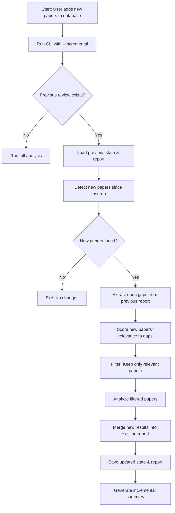

# INCR-W2-1: CLI Incremental Review Mode

**Wave:** 2 (Integration)  
**Priority:** 🔴 Critical  
**Effort:** 8-10 hours  
**Status:** 🟡 Blocked (requires Wave 1)  
**Assignable:** Backend Developer

---

## Overview

Implement end-to-end incremental review mode in the CLI pipeline orchestrator. This integrates all Wave 1 utilities (gap extraction, relevance scoring, pre-filtering, result merging, state management) into a cohesive workflow that allows users to continue previous reviews by adding new papers without re-analyzing the entire database.

---

## Dependencies

**Prerequisites (Wave 1):**
- ✅ INCR-W1-1 (Gap Extraction Engine)
- ✅ INCR-W1-2 (Paper Relevance Assessor)
- ✅ INCR-W1-3 (Result Merger Utility)
- ✅ INCR-W1-4 (CLI Output Directory Selection)
- ✅ INCR-W1-5 (Orchestrator State Manager)
- ✅ INCR-W1-6 (Pre-filter Pipeline Integration)

**Blocks:**
- INCR-W2-4 (Incremental Analysis Integration Tests)
- INCR-W3-1 (Dashboard Job Genealogy Visualization)

---

## Scope

### Included
- [x] `--incremental` CLI mode (continue previous review)
- [x] Automatic detection of new papers since last run
- [x] Gap-targeted pre-filtering of new papers only
- [x] Incremental result merging (add to existing report)
- [x] Parent-child job tracking in state
- [x] Progress reporting (X new papers, Y gaps closed)
- [x] Backward compatibility (works with existing full-mode)
- [x] Integration tests

### Excluded
- ❌ Multi-user concurrent reviews (single process only)
- ❌ Cross-database merging (same database only)
- ❌ Manual gap selection (auto-targets all gaps)

---

## Technical Specification

### User Workflow



### CLI Interface

```bash
# Full analysis (existing behavior)
python pipeline_orchestrator.py
python pipeline_orchestrator.py --force

# Incremental analysis (NEW)
python pipeline_orchestrator.py --incremental
python pipeline_orchestrator.py --incremental --output-dir reviews/update_2025_02

# Preview incremental changes
python pipeline_orchestrator.py --incremental --dry-run

# Continue specific review
python pipeline_orchestrator.py --incremental --parent-job-id review_20250115_103000
```

### Implementation

#### Part 1: Update pipeline_orchestrator.py

```python
# pipeline_orchestrator.py

class PipelineOrchestrator:
    """Enhanced orchestrator with incremental mode support."""
    
    def __init__(
        self,
        checkpoint_file: Optional[str] = None,
        resume: bool = False,
        resume_from: Optional[str] = None,
        config: Optional[Dict[str, Any]] = None,
    ):
        # ... existing initialization ...
        
        # NEW: Incremental mode config
        self.incremental_mode = config.get('incremental', False) if config else False
        self.force_full_analysis = config.get('force', False) if config else False
        self.parent_job_id = config.get('parent_job_id') if config else None
        
        # If force is True, disable incremental
        if self.force_full_analysis:
            self.incremental_mode = False
        
        self.log(f"Analysis mode: {'INCREMENTAL' if self.incremental_mode else 'FULL'}")
    
    def run_pipeline(self):
        """
        Run the literature review pipeline.
        
        NEW: Supports incremental mode - only analyzes new papers.
        """
        try:
            # --- Check for incremental prerequisites ---
            if self.incremental_mode:
                if not self._check_incremental_prerequisites():
                    self.log("⚠️  Incremental prerequisites not met, falling back to full analysis")
                    self.incremental_mode = False
            
            # --- Run stages ---
            if self.incremental_mode:
                self._run_incremental_pipeline()
            else:
                self._run_full_pipeline()
        
        except Exception as e:
            self.log(f"❌ Pipeline failed: {e}", "ERROR")
            raise
    
    def _check_incremental_prerequisites(self) -> bool:
        """
        Check if incremental mode can run.
        
        Returns:
            True if prerequisites met, False otherwise
        """
        # 1. Check for previous analysis output
        gap_report_path = os.path.join(self.output_dir, 'gap_analysis_report.json')
        if not os.path.exists(gap_report_path):
            self.log(f"⚠️  No previous gap analysis report found: {gap_report_path}")
            return False
        
        # 2. Check for state file
        state_file = os.path.join(self.output_dir, 'orchestrator_state.json')
        if not os.path.exists(state_file):
            self.log(f"⚠️  No previous state file found: {state_file}")
            return False
        
        # 3. Load state and verify it's complete
        from literature_review.utils.state_manager import StateManager
        
        state_manager = StateManager(state_file)
        state = state_manager.load_state()
        
        if not state or not state.analysis_completed:
            self.log(f"⚠️  Previous analysis incomplete")
            return False
        
        self.log(f"✅ Incremental prerequisites met")
        self.log(f"   Parent job: {state.job_id}")
        self.log(f"   Last run: {state.completed_at}")
        
        # Store parent job ID for lineage tracking
        self.parent_job_id = state.job_id
        
        return True
    
    def _run_incremental_pipeline(self):
        """
        Run incremental pipeline (gap-targeted analysis of new papers).
        """
        self.log("\n" + "=" * 80)
        self.log("INCREMENTAL REVIEW MODE")
        self.log("=" * 80)
        
        # --- Stage 1: Load previous analysis ---
        self.log("\n[1/7] Loading previous analysis...")
        
        from literature_review.utils.state_manager import StateManager
        
        state_file = os.path.join(self.output_dir, 'orchestrator_state.json')
        state_manager = StateManager(state_file)
        previous_state = state_manager.load_state()
        
        self.log(f"  - Previous job: {previous_state.job_id}")
        self.log(f"  - Papers analyzed: {previous_state.papers_analyzed}")
        self.log(f"  - Overall coverage: {previous_state.overall_coverage:.1f}%")
        self.log(f"  - Open gaps: {previous_state.gap_metrics.total_gaps}")
        
        # --- Stage 2: Detect new papers ---
        self.log("\n[2/7] Detecting new papers...")
        
        # Load current database
        import pandas as pd
        df_current = pd.read_csv('neuromorphic-research_database.csv')
        
        # Compute hash
        import hashlib
        current_hash = hashlib.md5(df_current.to_csv(index=False).encode()).hexdigest()
        
        if current_hash == previous_state.database_hash:
            self.log("  ✅ No changes detected in database")
            self.log("  Use --force to re-analyze all papers")
            return
        
        # Find new papers (simple approach: compare row count)
        # TODO: More sophisticated diff (compare DOIs, titles, etc.)
        new_papers_count = len(df_current) - previous_state.database_size
        
        if new_papers_count <= 0:
            self.log(f"  ✅ No new papers detected")
            return
        
        self.log(f"  📄 Found {new_papers_count} new papers")
        
        # Extract new papers (assume appended to end)
        new_papers = df_current.tail(new_papers_count).to_dict('records')
        
        # --- Stage 3: Extract gaps ---
        self.log("\n[3/7] Extracting open gaps...")
        
        from literature_review.utils.gap_extractor import GapExtractor
        
        gap_report_path = os.path.join(self.output_dir, 'gap_analysis_report.json')
        extractor = GapExtractor(gap_report_path=gap_report_path, threshold=0.7)
        gaps = extractor.extract_gaps()
        
        if not gaps:
            self.log(f"  ✅ No open gaps - all requirements met!")
            self.log(f"  New papers will be analyzed anyway (use --no-incremental to skip)")
            # Could exit here, but let's analyze anyway to update coverage
        
        self.log(f"  📊 Extracted {len(gaps)} open gaps")
        
        # --- Stage 4: Score paper relevance ---
        self.log("\n[4/7] Scoring paper relevance to gaps...")
        
        from literature_review.utils.relevance_scorer import RelevanceScorer
        
        scorer = RelevanceScorer()
        
        # Score each new paper against all gaps
        paper_scores = {}
        for paper in new_papers:
            paper_id = paper.get('DOI', paper.get('Title', str(hash(str(paper)))))
            
            if gaps:
                scores = [scorer.score_relevance(paper, gap) for gap in gaps]
                paper_scores[paper_id] = max(scores) if scores else 0.0
            else:
                # No gaps - analyze all new papers
                paper_scores[paper_id] = 1.0
        
        # Apply relevance threshold
        relevance_threshold = self.config.get('relevance_threshold', 0.50)
        
        papers_to_analyze = [
            paper for paper in new_papers
            if paper_scores.get(
                paper.get('DOI', paper.get('Title', str(hash(str(paper))))),
                0.0
            ) >= relevance_threshold
        ]
        
        papers_skipped = len(new_papers) - len(papers_to_analyze)
        
        self.log(f"  ✅ Relevance scoring complete:")
        self.log(f"     - Papers to analyze: {len(papers_to_analyze)}")
        self.log(f"     - Papers skipped: {papers_skipped}")
        self.log(f"     - Threshold: {relevance_threshold * 100:.0f}%")
        
        if not papers_to_analyze:
            self.log(f"  ⚠️  No relevant papers found above threshold")
            self.log(f"  Consider lowering threshold or running full analysis")
            return
        
        # --- Stage 5: Run analysis on filtered papers ---
        self.log(f"\n[5/7] Analyzing {len(papers_to_analyze)} papers...")
        
        # Create temporary CSV for filtered papers
        import tempfile
        with tempfile.NamedTemporaryFile(mode='w', suffix='.csv', delete=False) as tmp_csv:
            pd.DataFrame(papers_to_analyze).to_csv(tmp_csv.name, index=False)
            tmp_csv_path = tmp_csv.name
        
        try:
            # Run orchestrator on filtered papers
            from literature_review import orchestrator
            
            # Temporarily override database file
            original_db = orchestrator.RESEARCH_DB_FILE
            orchestrator.RESEARCH_DB_FILE = tmp_csv_path
            
            # Run analysis (will generate new gap_analysis_report.json)
            orchestrator.main(output_folder=self.output_dir + '_incremental_temp')
            
            # Restore original database
            orchestrator.RESEARCH_DB_FILE = original_db
        
        finally:
            os.remove(tmp_csv_path)
        
        # --- Stage 6: Merge results ---
        self.log(f"\n[6/7] Merging incremental results...")
        
        from literature_review.utils.result_merger import ResultMerger
        
        merger = ResultMerger()
        
        base_report_path = os.path.join(self.output_dir, 'gap_analysis_report.json')
        incremental_report_path = os.path.join(
            self.output_dir + '_incremental_temp',
            'gap_analysis_report.json'
        )
        
        merged_report = merger.merge_reports(
            base_report_path=base_report_path,
            incremental_report_path=incremental_report_path,
            conflict_resolution='highest_score'  # Use best evidence
        )
        
        # Save merged report
        merger.save_report(merged_report, base_report_path)
        
        self.log(f"  ✅ Results merged successfully")
        
        # --- Stage 7: Update state ---
        self.log(f"\n[7/7] Updating orchestrator state...")
        
        # Create new state for this incremental run
        new_state = state_manager.create_new_state(
            database_path='neuromorphic-research_database.csv',
            database_hash=current_hash,
            database_size=len(df_current),
            job_type=JobType.INCREMENTAL,
            parent_job_id=self.parent_job_id
        )
        
        # Update metrics
        new_state.papers_analyzed = len(papers_to_analyze)
        new_state.papers_skipped = papers_skipped
        new_state.analysis_completed = True
        new_state.completed_at = datetime.now().isoformat()
        
        # Compute gaps closed
        from literature_review.utils.gap_extractor import GapExtractor
        new_extractor = GapExtractor(gap_report_path=base_report_path, threshold=0.7)
        new_gaps = new_extractor.extract_gaps()
        
        gaps_closed = previous_state.gap_metrics.total_gaps - len(new_gaps)
        
        new_state.incremental_state.papers_added_since_parent = len(papers_to_analyze)
        new_state.incremental_state.gaps_closed_since_parent = gaps_closed
        new_state.incremental_state.new_gaps_identified = max(0, len(new_gaps) - previous_state.gap_metrics.total_gaps)
        
        # Save state
        state_manager.save_state(new_state)
        
        self.log(f"  ✅ State updated: {new_state.job_id}")
        
        # --- Summary ---
        self.log("\n" + "=" * 80)
        self.log("INCREMENTAL REVIEW COMPLETE")
        self.log("=" * 80)
        self.log(f"📊 Summary:")
        self.log(f"  - New papers added: {new_papers_count}")
        self.log(f"  - Papers analyzed: {len(papers_to_analyze)}")
        self.log(f"  - Papers skipped: {papers_skipped}")
        self.log(f"  - Gaps closed: {gaps_closed}")
        self.log(f"  - Remaining gaps: {len(new_gaps)}")
        self.log(f"  - Parent job: {self.parent_job_id}")
        self.log(f"  - New job: {new_state.job_id}")
        self.log(f"\n📁 Output: {self.output_dir}/gap_analysis_report.json")
    
    def _run_full_pipeline(self):
        """
        Run full pipeline (existing behavior).
        """
        # Existing full pipeline logic
        self.run_stage('orchestrator', 'literature_review.orchestrator', 'Gap Analysis')
        # ... other stages ...
```

#### Part 2: CLI Arguments

```python
# pipeline_orchestrator.py - main()

def main():
    parser = argparse.ArgumentParser(
        description="Run the full Literature Review pipeline with incremental mode support"
    )
    
    # ... existing arguments ...
    
    # NEW: Incremental mode arguments
    parser.add_argument(
        "--incremental",
        action="store_true",
        default=False,
        help="Enable incremental mode (analyze only new papers since last run)"
    )
    parser.add_argument(
        "--force",
        action="store_true",
        help="Force full re-analysis (overrides --incremental)"
    )
    parser.add_argument(
        "--parent-job-id",
        type=str,
        help="Parent job ID to continue from (for job lineage tracking)"
    )
    
    args = parser.parse_args()
    
    # ... load config ...
    
    # Set incremental mode
    config['incremental'] = args.incremental
    config['force'] = args.force
    
    if args.parent_job_id:
        config['parent_job_id'] = args.parent_job_id
    
    # Create and run orchestrator
    orchestrator = PipelineOrchestrator(
        checkpoint_file=args.checkpoint_file,
        resume=args.resume,
        resume_from=args.resume_from,
        config=config
    )
    
    orchestrator.run_pipeline()
```

---

## Testing Strategy

### Unit Tests

Create `tests/unit/test_incremental_mode.py`:

```python
import pytest
from unittest.mock import Mock, patch, MagicMock
from pipeline_orchestrator import PipelineOrchestrator

def test_incremental_prerequisites_check(tmp_path):
    """Test checking for incremental prerequisites."""
    output_dir = tmp_path / "output"
    output_dir.mkdir()
    
    # Create mock gap report
    gap_report = output_dir / "gap_analysis_report.json"
    gap_report.write_text('{"pillars": {}}')
    
    # Create mock state
    state_file = output_dir / "orchestrator_state.json"
    state_file.write_text('''{
        "schema_version": "2.0",
        "job_id": "test_job",
        "analysis_completed": true,
        "completed_at": "2025-01-15T10:00:00"
    }''')
    
    config = {'output_dir': str(output_dir)}
    orch = PipelineOrchestrator(config=config)
    
    assert orch._check_incremental_prerequisites() == True

def test_incremental_prerequisites_missing_report(tmp_path):
    """Test incremental fails if no previous report."""
    output_dir = tmp_path / "output"
    output_dir.mkdir()
    
    config = {'output_dir': str(output_dir)}
    orch = PipelineOrchestrator(config=config)
    
    assert orch._check_incremental_prerequisites() == False

def test_new_paper_detection(tmp_path):
    """Test detecting new papers since last run."""
    # Mock previous state with 100 papers
    previous_state = Mock()
    previous_state.database_size = 100
    previous_state.database_hash = "old_hash"
    
    # Mock current database with 120 papers
    import pandas as pd
    current_df = pd.DataFrame([{'Title': f'Paper {i}'} for i in range(120)])
    
    # New papers = 120 - 100 = 20
    new_papers = current_df.tail(20)
    
    assert len(new_papers) == 20

def test_incremental_mode_no_new_papers(tmp_path, capsys):
    """Test incremental mode exits early if no new papers."""
    # Setup previous state with same hash as current
    # Should detect no changes and exit
    pass  # Implement with full mocking
```

### Integration Tests

Create `tests/integration/test_incremental_cli.py`:

```python
import pytest
import subprocess
import json
from pathlib import Path

def test_incremental_mode_e2e(tmp_path):
    """Test end-to-end incremental workflow."""
    output_dir = tmp_path / "review"
    output_dir.mkdir()
    
    # Step 1: Run baseline analysis
    result1 = subprocess.run(
        [
            'python', 'pipeline_orchestrator.py',
            '--output-dir', str(output_dir),
            '--dry-run'
        ],
        capture_output=True,
        text=True,
        timeout=60
    )
    
    assert result1.returncode == 0
    
    # Step 2: Add new papers to database
    # (In real test, would modify neuromorphic-research_database.csv)
    
    # Step 3: Run incremental analysis
    result2 = subprocess.run(
        [
            'python', 'pipeline_orchestrator.py',
            '--incremental',
            '--output-dir', str(output_dir),
            '--dry-run'
        ],
        capture_output=True,
        text=True,
        timeout=60
    )
    
    # Should detect incremental mode
    assert 'INCREMENTAL' in result2.stdout or 'incremental' in result2.stdout.lower()

def test_force_overrides_incremental():
    """Test --force disables --incremental."""
    result = subprocess.run(
        [
            'python', 'pipeline_orchestrator.py',
            '--incremental',
            '--force',
            '--dry-run'
        ],
        capture_output=True,
        text=True,
        timeout=30
    )
    
    # Should run full analysis (force overrides)
    assert 'FULL' in result.stdout or 'full' in result.stdout.lower()
```

---

## Deliverables

- [ ] Incremental mode in `pipeline_orchestrator.py`
- [ ] CLI arguments (`--incremental`, `--force`, `--parent-job-id`)
- [ ] New paper detection logic
- [ ] Gap extraction → scoring → filtering → merging integration
- [ ] Parent-child job tracking
- [ ] Progress reporting
- [ ] Unit tests in `tests/unit/test_incremental_mode.py`
- [ ] Integration tests in `tests/integration/test_incremental_cli.py`
- [ ] README documentation

---

## Success Criteria

✅ **Functional:**
- `--incremental` mode works end-to-end
- Only new papers analyzed (not entire database)
- Results merge correctly into existing report
- Job lineage tracked in state
- Falls back to full mode if prerequisites missing

✅ **Quality:**
- Unit tests pass (90% coverage)
- Integration tests pass
- No data loss during merging
- Backward compatible (full mode still works)

✅ **Performance:**
- 60-80% faster than full analysis (for typical incremental updates)
- <10% overhead for prerequisite checks

---

## Usage Examples

### Basic Incremental Workflow

```bash
# Initial baseline analysis
python pipeline_orchestrator.py --output-dir reviews/baseline

# ... add new papers to database ...

# Incremental update
python pipeline_orchestrator.py --incremental --output-dir reviews/baseline

# Output:
# [1/7] Loading previous analysis...
#   - Previous job: review_20250115_103000
#   - Papers analyzed: 150
#   - Open gaps: 28
# [2/7] Detecting new papers...
#   📄 Found 25 new papers
# [3/7] Extracting open gaps...
#   📊 Extracted 28 open gaps
# [4/7] Scoring paper relevance to gaps...
#   ✅ Papers to analyze: 8
#   ✅ Papers skipped: 17 (68% filtered)
# [5/7] Analyzing 8 papers...
# [6/7] Merging incremental results...
# [7/7] Updating orchestrator state...
# 
# ✅ INCREMENTAL REVIEW COMPLETE
# 📊 Summary:
#   - New papers added: 25
#   - Papers analyzed: 8
#   - Papers skipped: 17
#   - Gaps closed: 5
#   - Remaining gaps: 23
```

### Preview Incremental Changes

```bash
python pipeline_orchestrator.py --incremental --dry-run

# Shows what would be analyzed without running
```

### Force Full Re-analysis

```bash
python pipeline_orchestrator.py --force --output-dir reviews/baseline

# Ignores previous state, re-analyzes everything
```

---

## Documentation Updates

### README.md

Add "Incremental Review Mode" section:

```markdown
## Incremental Review Mode

Update existing reviews by adding new papers without re-analyzing the entire database.

### Quick Start

```bash
# 1. Run baseline analysis
python pipeline_orchestrator.py --output-dir reviews/baseline

# 2. Add new papers to neuromorphic-research_database.csv

# 3. Run incremental update
python pipeline_orchestrator.py --incremental --output-dir reviews/baseline
```

### How It Works

1. **Loads previous analysis** - Reads existing gap report and state
2. **Detects new papers** - Compares database hash to find additions
3. **Extracts gaps** - Identifies unfilled requirements from previous run
4. **Scores relevance** - Uses ML to predict which papers close gaps
5. **Pre-filters** - Skips low-relevance papers (50%+ threshold)
6. **Analyzes** - Runs deep analysis on filtered papers only
7. **Merges** - Combines new evidence into existing report
8. **Tracks lineage** - Records parent→child job relationship

### Benefits

- **60-80% faster** - Only analyzes new, relevant papers
- **Cost savings** - $15-30 per incremental run (vs $50+ full)
- **Preserves work** - Builds on previous analysis
- **Tracks changes** - See gaps closed over time

### Advanced Usage

```bash
# Preview what would be analyzed
python pipeline_orchestrator.py --incremental --dry-run

# Force full re-analysis
python pipeline_orchestrator.py --force

# Continue specific review
python pipeline_orchestrator.py --incremental --parent-job-id review_20250115_103000
```

### Troubleshooting

**"Incremental prerequisites not met"**
- Ensure previous gap_analysis_report.json exists
- Check orchestrator_state.json is complete
- Run full analysis first: `python pipeline_orchestrator.py`

**"No new papers detected"**
- Verify you added papers to database CSV
- Check database hash changed
- Use `--force` to re-analyze anyway
```

---

## Migration Guide

For existing users:

```markdown
## Migrating to Incremental Mode

**No action required!** Incremental mode is opt-in.

**To enable:**
1. Run one full analysis to create baseline
2. Add `--incremental` flag for subsequent runs

**Example:**

```bash
# Before (always full analysis)
python pipeline_orchestrator.py

# After (incremental updates)
python pipeline_orchestrator.py --incremental
```

**Recommended workflow:**
- Monthly full analysis (`--force`)
- Weekly incremental updates (`--incremental`)
- Use separate output dirs for comparison
```

---

## Rollback Plan

If incremental mode causes issues:
1. Use `--force` to run full analysis
2. Previous behavior unchanged
3. No data corruption (merging uses atomic writes)

---

## Notes

- **Critical Wave 2 task** - Enables end-to-end incremental workflow
- **Integrates all Wave 1 utilities** - Gap extraction, scoring, merging, state
- **Non-breaking** - Full mode still default, incremental is opt-in
- **60-80% time savings** - Typical incremental updates 10-20 min vs 60+ min

---

**Status:** 🟡 Blocked (requires Wave 1 completion)  
**Assignee:** TBD  
**Estimated Start:** Week 2, Day 1  
**Estimated Completion:** Week 2, Day 3
